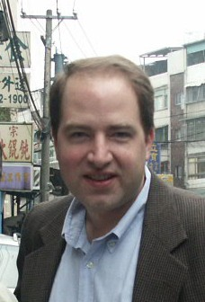

## Professional information

Here is my [curriculum vitae](BenRead-CurriculumVitae.pdf), my [UCSC profile](http://politics.ucsc.edu/faculty/singleton.php?&singleton=true&cruz_id=bread), and my [Google Scholar](http://scholar.google.com/citations?user=4f7G7WAAAAAJ) profile.

## About my institution

More about [UC Santa Cruz](http://www.ucsc.edu/), a [one-page overview of UCSC](UCSC_on_One_Page.htm), the [Politics Department](http://politics.ucsc.edu), and the [East Asian Studies](http://eastasianstudies.ucsc.edu/index.html) program.

## Bio
Born in Madison, Wisc., Ben Read spent a year of his childhood in the Dutch village of Overasselt and another in socialist Beijing, undergoing indoctrination at public schools in all three localities. He later rounded out his education at Cornell, UC Berkeley, and Harvard. Ben has worked and studied in mainland China for a total of nearly six years and Taiwan for six months, and speaks Mandarin fluently. Following graduate training, he taught at the University of Iowa before joining the Politics faculty at UC Santa Cruz in the summer of 2008. He enjoys hiking and mountain biking, and is an instrument-rated private pilot.

## Contact information

Politics Department  
Merrill Faculty Services  
1156 High Street  
University of California, Santa Cruz  
Santa Cruz, CA 95064

office: 831-459-4469  
email: bread (at) ucsc (dot) edu

## Office hours

None until the week of September 25, 2017.
